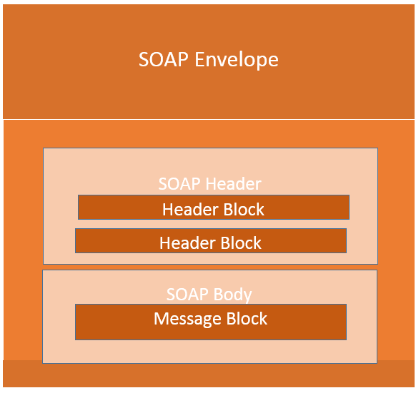

# I Web Services

---

@snap[north-west text-08]
### I Web Services
“A web service is a software system designed to support interoperable machine-to-machine interaction over a network. It has an interface described in a machine-processable format “ (W3C, Web Services Glossary )
  
Parliamo quindi di:
@ol[]
1. servizio - offre un servizio specifico, ad esempio: servizio prenotazioni, dati geolocalizzazioni, ...;
1. web - invocabile da web, utilizza i protocolli del web;
1. interfaccia - espone in modo rigoroso in un formato processabile da un client software i servizi che espone;
@olend

@snapend
---
@snap[north-west text-07]

 
*WSD*: web service descriptor, un formato processabile da un client che descrive l'interfaccia esposta.
@snapend
---
@snap[north-west]
### RPC - Remote Procedure Call

 
I Web Service, 'un altro modo per fare RPC'.
@snapend
---
@snap[west]
Esistono due modalità principali di Web Services:
@ul[]
* SOAP - **S**imple **O**bject **A**ccess **P**rotocol;
* REST - **RE**presentional **S**tate **T**ransfer;
@snapend
---
@snap[north-west]
### SOAP
Vediano tremite un esempio di capire la funzione del WSDL, partendo dall'esempio di un servizio che ritorna i valori delle azioni (Stocks). 
 
Il WSDL, è un documento in formato XML, descritto come specifica del W3C, che permette di definire in
modo preciso l'interfaccia esposta dai Web Services.
@snapend
---?gist=MassimoCappellano/d15675cbabf291c47705512e02581622&lang=xml&title=Esempio WSDL di un servizio per chiedere i valori di borsa di un'azione:
@snap[text-08]
@[9-27](Types -- a container for data type definitions using some type system (such as XSD).)
@[29-35](Message -- an abstract, typed definition of the data being communicated.)
@[37-42](Operation -- an abstract description of an action supported by the service.)
@snapend
---

@snap[north-west text-07]
### Le altre parti specificate nel WSDL sono:
@ul
* Port Type -- an abstract set of operations supported by one or more endpoints.
* Binding -- a concrete protocol and data format specification for a particular port type.
* Port -- a single endpoint defined as a combination of a binding and a network address.
* Service -- a collection of related endpoints.
@ulend
 
 
Tutte queste parti specificano in modo preciso il 'contratto' tra client e il web service. Abbiamo già detto che il WSDL è espresso in linguaggio XML.  
 
XML è un linguaggio di markup che permette di descrivere delle strutture dati come nel caso del WSDL, in cui descrive il tipo dei dati dei metodi o anche rappresentare dati veri e propri, come nel caso dei massaggi scambiati tra client e server.  
@snapend

---
@snap[north-west]
### SOAP Message

 
Le parti di cui è composto un messaggio SOAP stabilito dallo standard.
@snapend

---?gist=MassimoCappellano/4803465f006725a9044a78f0e7a066b7&title=Servizio che chiede i valori di un'azione
### SOAP Request

---?gist=MassimoCappellano/33ae0970f3d193d3c7b1897f72626187&title=Messaggio di ritorno alla richiesta
### SOAP Response
---
### Cos'è REST

REST (REpresentational State Transfer) definendolo come uno stile architetturale per la progettazione e la creazione di servizi Web, in altre parole REST rappresenta un insieme di regole che definiscono come scambiare risorse in un sistema distribuito

---

