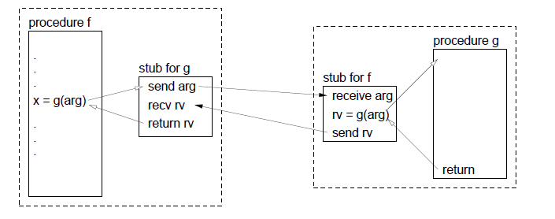
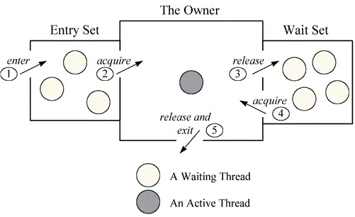
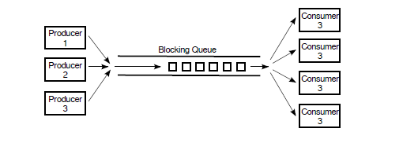

# I Web Services

---

@snap[north-west text-08]
### I Web Services
“A web service is a software system designed to support interoperable machine-to-machine interaction over a network. It has an interface described in a machine-processable format “ (W3C, Web Services Glossary )
<br><br>
Parliamo quindi di:
@ol[]
1. servizio - offre un servizio specifico, ad esempio: servizio prenotazioni, dati geolocalizzazioni, ...;
1. web - invocabile da web, utilizza i protocolli del web;
1. interfaccia - espone in modo rigoroso in un formato processabile da un client software i servizi che espone;
@olend

@snapend
---
@snap[north-west text-07]

<br>
*WSD*: web service descriptor, un formato processabile da un client che descrive l'interfaccia esposta.
@snapend
---
@snap[north-west]
### RPC - Remote Procedure Call

<br>
I Web Service, 'un altro modo per fare RPC'.
@snapend
---
@snap[west]
Esistono due modalità principali di Web Services:
@ul[]
* SOAP - **S**imple **O**bject **A**ccess **P**rotocol;
* REST - **RE**presentional **S**tate **T**ransfer;
@snapend
---
@snap[north-west]
### SOAP
Vediano tremite un esempio di capire la funzione del WSDL, partendo dall'esempio di un servizio che ritorna i valori delle azioni (Stocks).<br>
<br>
Il WSDL, è un documento in formato XML, descritto da delle specifiche del W3C che permette di definire in
modo preciso l'interfaccia esposta del nostro Web Service.
@snapend
---?gist=MassimoCappellano/d15675cbabf291c47705512e02581622&lang=xml&title=Esempio WSDL di un servizio per chiedere i valori di borsa di un'azione:


---
@snap[west text-06]
Esempio Web Service SOAP:<br>

https://geoservices.tamu.edu/Services/Geocode/WebService/v04_01/Simple/SOAP/
<br>
<br>
**API URL:**<br>
https://geoservices.tamu.edu/Services/Geocode/WebService/GeocoderService_V04_01.asmx
<br>
<br>
**WSDL:**<br>
https://geoservices.tamu.edu/Services/Geocode/WebService/GeocoderService_V04_01.asmx?WSDL

@snapend
---
@snap[west text-07]
Il *Thread A*, consumatore e *Thread B*, produttore, eseguono questo codice, dove *obj* è qualche oggetto:

```java
// Thread A: consumatore
if ( resultIsAvailable() == false )
    obj.wait(); // wait for notification that the result is available
useTheResult();
```

```
// Thread B: produttore
generateTheResult();
obj.notify(); // send out a notification that the result is available
```

Ora c'è qualche subdola race condition in questo codice. 
@snapend

---

@snap[north-west]
```java
// Thread A: consumatore
if ( resultIsAvailable() == false )
    obj.wait(); // wait for notification that the result is available
useTheResult();
```

```
// Thread B: produttore
generateTheResult();
obj.notify(); // send out a notification that the result is available
```
@snapend

@snap[south-west text-07]
I due thread potrebbero eseguire il loro codice nel seguente ordine:
@ol[]
1. Il *Thread A* controlla **resultIsAvailable()** è trova che il risultato non è disponibile, così decide di invocare **obj.wait()**, ma prima che lo faccia, @note[nota 1]
1. Il *Thread B* termina di generare il risultato e invoca **obj.notify()** @note[nota 2]
1. Il *Thread A* chiama **obj.wait()** per aspettare la notifica che il risultato è disponibile. @note[note 3]
@olend

Nello Step 3, il *Thread A* sta aspettando per una notifica che non arriverà mai, perché **notify()** è già stata invocata nello Step 2. 
Questo è un tipo di deadlock che lascia il *Thread A* aspettare per sempre.

@snapend

---
@snap[north-west text-07]
Quindi ci vuole qualche tipo di sincronizzazione. La soluzione è includere sia il codice di *Thread A* che di *Thread B* nello statement **synchronized**, ed è molto naturale sincronizzare sullo stesso oggetto, obj, che è utilizzato per le chiamate di **wait()** e **notify()**. 
<br><br>In effetti, siccome la sincronizzazione sarebbe quasi sempre obbligatoria quando  si utilizzano wait() e notify(), **Java lo rende un requisito obbligatorio**. 
<br><br>
In Java, un thread può legalmente invocare **obj.wait()** e **obj.notify()** solo se il thread ha acquisito il lock di sincronizzazione associato all'oggetto **obj**. 
<br><br>Se non ha acquisito prima il lock, allora viene lanciata un'eccezione. (L'eccezione è di tipo *java.lang.IllegalMonitorStateException*, che è di tipo runtime 
e quindi non deve essere gestita obbligatoriamente). Una ulteriore complicazione è che il metodo wait() può lanciare l'eccezione *java.lang.InterruptedException* 
e quindi deve essere invocata nello statement di  try che cattura quella eccezione.
@snapend
---

@snap[north-west  text-09]
### Produttore/consumatore semplificato (un solo elemento)
Facciamo ad esempio il caso di un risultato calcolato da un thread che deve essere reso disponibile ad un altro thread. 
Assumendo che c'è una variabile condivisa **sharedResult** che è utilizzata per trasferire il risultato dal produttore al consumatore. 
Quando il risultato è pronto, il produttore setta il valore della variabile a un valore non nullo. 
Il consumatore può controllare se il risultato è pronto controllando se il valore della variabile **sharedResult** è nullo. 
Utilizziamo la variabile **lock** per sincronizzare.
@snapend

---

@snap[north-west]
Codice produttore:
```java
makeResult = generateTheResult(); // Not synchronized!
synchronized(lock) {
    sharedResult = makeResult;
    lock.notify();
}
```
Codice consumatore:
```
synchronized(lock) {
    while ( sharedResult == null ) {
        try {
            lock.wait();
        }
        catch (InterruptedException e) {
            }
    }
    useResult = sharedResult;
}
useTheResult(useResult); // Not synchronized!
```
@snapend

---

@snap[north-west text-05]
Da notare una cosa: **lock.wait()** non finisce finché **lock.notify()** non è invocato, 
ma siccome entrambi i metodi sono chiamati all'interno di blocchi synchronized che si sincronizzano sullo stesso oggetto, 
non dovrebbe essere impossibile per entrambi i metodi essere eseguiti contemporaneamente?<br><br> 
Infatti, **lock.wait()** è un caso speciale: quando un thread chiama **lock.wait()**, esso cede il lock che teneva sull'oggetto sincronizzato.<br><br> 
Questo dà a un altro thread la possibilità di eseguire il blocco **synchronized(lock)** che contiene lo statement **lock.notify()**. Dopo che il secondo 
thread (il produttore) esce dal blocco sincronizzato (avendo prima invocato la notify), rilascia quindi il lock che può essere a questo 
punto acquisito dal thread consumer che è stato risvegliato.<br>

@snapend

---

@snap[north-west text-08]
### Produttore/consumatore
In un problema produttore/consumatore completo, molti risultati sono prodotti da uno o più produttori e sono consumati da uno o più consumatori. 

Invece di avere un unico oggetto condiviso, *sharedResult*, abbiamo una lista di oggetti che sono stati prodotti e non ancora consumati.<br><br>

La struttura dati che implementa questa problematica di produttore e consumatore è quella di una **lista** in cui i produttori mettono gli elementi prodotti e i consumatori prendono gli elementi da consumare.

@snapend
---

@snap[north-west text-08]
### Blocking queue
Questa lista deve essere sincronizzata per evitare race condition ma in più deve far si che se la lista è vuota 
e un consumatore cerca di prelevare un elemento dalla lista, il consumatore sia messo in wait (bloccato) fino a che 
un produttore non inserisce un elemento e notifica l'inserimento: per questo motivo, questa struttura, si chiama **blocking queue**.
<br>

@snapend

---?gist=MassimoCappellano/34a86252db41dc4d28d4b21424246ea7&lang=Java&title=Implementazione di una blocking queue
@[4](variabile interna di tipo LinkedList)
@[19-25](metodo take, per prendere elemento dalla coda)
@[12-17](metodo add, per aggiungere elemento alla coda)
@[6-10](metodo clean, per svuotare la coda)

---

@snap[north-west text-07]
### Il metodo notifyAll()
E' possibile che diversi thread siano in attesa di notifiche. 
Una chiamata a **obj.notify()** risveglia solo un thread che era in waiting su obj. 
Se si vuole risvegliare tutti i thread che erano in waiting su *obj*, bisogna invocare **obj.notifyAll()**. 
obj.notify() funziona nell'esempio sopra perché solo i thread consumatori potevano essere bloccati. 
Abbiamo bisogno che anche un solo thread dei consumatori sia risvegliato e non importa quale consumatore prenda l'elemento.<br><br> 
Consideriamo invece una blocking queue di **capacità massima limitata**, dove sia il consumatore che il produttore possono essere bloccati. 
Quando un elemento è aggiunto a una coda, noi vogliamo che il thread consumatore è  notificato, non invece magari un altro produttore. 
Una soluzione è chiamare la **notifyAll()** invece della notify(), che notificherà a tutti i thread, inclusi i consumatori che aspettano in waiting.
@snapend

---?gist=MassimoCappellano/9a14eafac275a29c107e46b67dcc2599&lang=Java&title=Blocking queue con limite massimo di elementi 
@[6-7](variabili interne condivise: queue e limit)
@[13-21](metodo enqueue)
@[23-32](metodo dequeue)

---
@snap[north-west]
Java ha due classi che implementano la blocking queue: 
**LinkedBlockingQueue** e **ArrayBlockingQueue**.<br><br> 
Questi sono tipi parametrici per permettere di specificare i tipi di elementi che la coda può contenere.<br><br> 
Entrambe le classi sono definite nel pacchetto **java.util.concurrent** ed entrambe implementano l'interfaccia **BlockingQueue**.
@snapend

---
 
@snap[north-west]
Un **ArrayBlockingQueue** ha una capacità massima che è specificata quando è creata.<br> 
Per esempio, per creare una coda bloccante che può contenere fino a 25 elementi di tipo *ItemType*, si può dire:
```java
ArrayBlockingQueue<ItemType> bqueue = new ArrayBlockingQueue<>(25);
```
<br>
Una **LinkedBlockingQueue** crea, invece, una blocking queue con capacità illimitata.<br> 
Per esempio:
```java
LinkedBlockingQueue<ItemType> bqueue = new LinkedBlockingQueue<>();
```
@snapend

---
@snap[north-west text-07]
Se *bqueue* è una coda bloccante che appartiene a una delle due classi, allora le seguenti operazioni sono definite:
@ul[](false)
- *bqueue.take()* - Rimuove un elemento dalla coda e lo ritorna risultato. Se la coda è vuota quando questo metodo è invocato, il thread che ha invocato il metodo **rimane bloccato** finché un elemento non sarà disponibile. Questo metodo lancia una *InterruptedException* se un thread è interrotto mentre è bloccato.
- *bqueue.put(item)* - Aggiunge un elemento alla coda. Se la coda ha una capacità limitata ed è piena, il thread che ha chiamato questo metodo, **rimane bloccato** finché non si libera posto nella coda. Questo metodo lancia una *InterruptedException* se il thread è interrotto mentre era bloccato.
- *bqueue.add(item)* - Aggiunge un elemento alla coda, se lo spazio è disponibile. Se la coda ha una capacità limitata e è piena, lancia una *IllegalStateException*. Questo metodo non è bloccante.
- *bqueue.clear()* - Rimuove tutti gli elementi dalla coda e li scarta.
@ulend
@snapend

---

@snap[north-west text-08]
### Concurrent Queue
Un' altra classe che rappresenta una coda è **ConcurrentLinkedQueue<E>** nel package **java.util.concurrent**.<br>

```java
ConcurrentLinkedQueue<E> queue = new ConcurrentLinkedQueue<>();
```
Questa classe non è di tipo blocking queue: il metodo per aggiungere un elemento x alla coda è **queue.add(x)**. 
Il metodo per rimuovere un elemento dalla testa della coda è **queue.poll()**.<br> 
La chiamata **queue.poll()** ritorna *null* se la coda è vuota; quindi **poll()** può essere utilizzato per testare se la coda è vuota 
o ritrovare l'elemento altrimenti.

@snapend

---

@snap[north-west text-08]
### Gli ExecutorService
Siccome i **thread pool** sono comuni nella programmazione concorrente, non è sorprendente che Java 
abbia tool di alto livello per creare e gestire thread pool.<br> 
L'interfaccia **ExecutorService**, nel package **java.util.concurrent**, definisce servizi che possono eseguire i task quando sono sottomessi ad esso. 

```java
int processors = Runtime.getRuntime().availableProcessors();
ExecutorService executor = Executors.newFixedThreadPool(processors);
```
Il metodo **executor.execute(task)** può essere utilizzato per sottomettere un oggetto, task, di tipo **Runnable**, per l'esecuzione. 
Il metodo **ritorna immediatamente** dopo aver messo l'oggetto task nella coda dei waiting task.

@snapend

---
@snap[north-west]
Internamente, i thread del thread pool si occupano di togliere i task dalla coda e di eseguirli.

@snapend
---
@snap[north-west text-07]
### Oggetti di tipo Lock 
Il metodo per proteggere un blocco di codice è con un **java.util.concurrent.locks.Lock** e l'implementazione **java.util.concurrent.locks.ReentrandLock**:
```java
myLock.lock(); // a ReentrantLock object
try
{
 // critical section
}
finally
{
   myLock.unlock(); // make sure the lock is unlocked even if an exception is thrown
}
```
questo costrutto garantisce che solo un thread alla volta può entrare in una sezione critica. 
Quando un thread invoca il metodo **lock()** di un object di tipo **Lock**, nessun altro thread può passare oltre questo statement. 
Quando altri thread chiamano il metodo **lock()** sullo stesso oggetto, sono sospesi finché il primo thread non invoca il metodo **unlock()** del lock object.
@snapend
---

@snap[north-west text-07]
### Oggetti di tipo Condition

L'interfaccia `Condition` nel package `java.util.concurrent.locks` ha metodi per la comunicazione tra i thread simili 
ai metodi del monitor di `Object`: `wait()`, `notify()` e `notifyAll()`. `Condition` ha i metodi `await()`, `signal()` e `signalAll()`.<br> 
Dove Lock rimpiazza l'utilizzo dei metodi e statement sincronizzati, Condition rimpiazza l'utilizzo dei metodi del monitor di Object.
<br><br>
<table>
<tr><th>`java.util.concurrents.locks.Condition`</th></tr>
<tr><td>`void await()` mette questo thread nell'insieme dei thread in wait su questa condizione</td></tr>
<tr><td>`void signalAll()` sblocca tutti i thread che sono in wait su questa condizione</td></tr>
<tr><td>`void signal()` sblocca un thread selezionato in modo random tra quelli in wait su questa condizione</td></tr>
</table>
@snapend

---
@snap[north-west text-08]
### Lock implicito vs Lock esplicito

Il seguente codice, con `synchronized`:

```java
public synchronized void method()
{
    // method body
}
```
è equivalente all'utilizzo di un oggetto di tipo Lock implicito:
```java
public void method()
{
    this.intrinsicLock.lock();
    try
    {
    // method body
    }
    finally { 
        this.intrinsicLock.unlock(); 
        }
}
```
---
@snap[north-west text-08]
Inoltre l'oggetto lock implicito ha associata una singola condition, anche essa implicita. 
Il metodo **wait()** aggiunge il thread alla coda dei thread in wait, 
e i metodi **notify()**/**notifyAll()** sboccano i thread in waiting.<br><br>
In altre parole chiamare **wait()**, **notify()** e **notifyAll()** è equivalente a:

```java
intrinsicCondition.await();
intrinsicCondition.signal();
intrinsicCondition.signalAll();
```
@snapend

+++

Differenti tipi di lock1

+++

Differenti tipi di lock2

---?gist=MassimoCappellano/d5485f6b114a7bcc361cf214c75e10b6&lang=java&title=Esempio Produttore/Consumatore
@[6-8](La variabile *lock* e le **Condition** *notFull* e *notEmpty*)
@[13-26](metodo *put*)
@[28-42](metodo *take*)

---
@snap[north-west span-100 text-08]
### Riepilogo
	
<ol>
	<li>Problematica collaborazione tra thread;</li>
	<li>Produttore e Consumatore;</li>
	<li>La struttura dati **blocking queue**;</li>
	<li>Le primitive **wait()**, **notify()** e **notifyAll()** a cosa servono;</li>
	<li>Implementazione di una **blocking queue** con primitive;</li>
	<li>Classi **ArrayBlockingQueue**, **LinkedBlockingQueue** e **ConcurrentQueue** in **java.util.concurrent**;</li>
	<li>Gli **ExecutorService** a cosa servono;</li>
	<li>Oggetti di tipo **Lock** e **Condition** in **java.util.concurrent.locks**;</li>
	<li>Implementazione di una blocking queue utilizzando le classi **Lock** e **Condition**;</li>
</ol>

@snapend

@snap[south span-100 text-06]
[Vai a @fa[external-link]](https://checksound.gitbook.io/corsojava/i-thread-e-concorrenza) Thread e concorrenza 
@snapend


